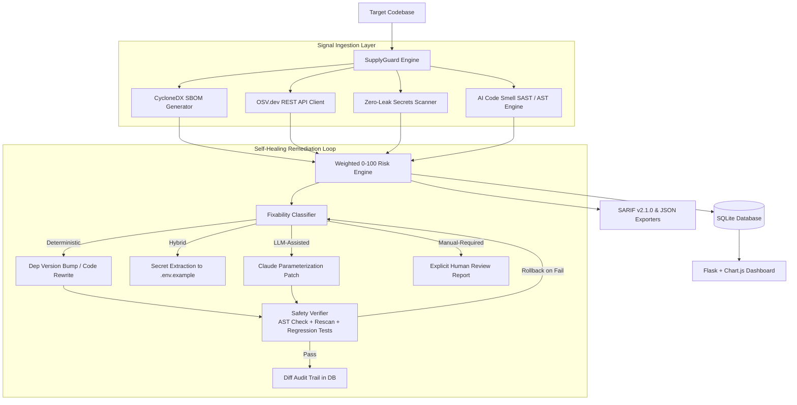

<div align="center">

# 🛡️ SupplyGuard

### **AI-Aware Software Supply Chain Security Scanner & Self-Healing Remediation Engine**

[](https://pypi.org/project/supplyguard/)
[](https://www.python.org/downloads/)
[](https://opensource.org/licenses/MIT)
[](https://github.com/supplyguard/supplyguard/actions)
[](https://docs.oasis-open.org/sarif/sarif/v2.1.0/sarif-v2.1.0.html)

<p align="center">
  <b>Detect supply chain risks, exposed secrets, and AI-generated code vulnerabilities in seconds.</b><br>
  <i>Compute an auditable 0–100 risk score, gate your CI/CD pipelines, and auto-heal fixable code with test-backed rollbacks.</i>
</p>

[Quickstart](#-quickstart) •
[Features](#-key-features) •
[Installation](#-installation) •
[CLI Reference](#-cli-command-reference) •
[CI/CD Integration](#-github-actions--cicd) •
[Architecture](#-architecture)

</div>

---

## ⚡ The Problem: AI Code & Supply Chain Chaos

Modern engineering teams move fast with AI coding assistants (Copilot, Cursor, Claude, ChatGPT). But AI models frequently introduce subtle, high-risk security flaws:
- **Hallucinated or outdated dependencies** with known CVEs
- **Hardcoded API keys and secrets** accidentally committed to repositories
- **Subtle AI-code smells**: unparameterized SQL queries, `subprocess(shell=True)`, disabled TLS validation (`verify=False`), and disabled JWT checks

**SupplyGuard solves this in one command.** It scans your repository across 4 security dimensions, unifies findings into a single risk score (0–100), outputs industry-standard SARIF reports, and safely auto-patches vulnerabilities without breaking your build.

---

## ✨ Key Features

| Feature | Description |
|---|---|
| 📦 **CycloneDX SBOM Generation** | Automatically parses Python project manifests (`requirements.txt`, `pyproject.toml`) and produces machine-readable Software Bills of Materials. |
| 🌐 **Live OSV.dev Correlation** | Batch queries the Open Source Vulnerability (OSV) database in real-time with sub-second lookups across all dependencies. |
| 🔑 **Zero-Leak Secrets Scanner** | Fast credential detection for AWS keys, OpenAI keys, JWT tokens, and private keys. Strictly stores redacted previews (`AKIA...XYZ`) to guarantee zero secrets leakage. |
| 🧠 **AI-Code Smell SAST Engine** | 10 specialized static analysis rules targeting common AI code generation antipatterns (CWE-89, CWE-78, CWE-295, CWE-489, CWE-347, CWE-916, etc.). |
| 🛡️ **Zero-Dependency Fallbacks** | Works out-of-the-box on Windows, macOS, and Linux with built-in pure Python AST analysis and regex engines if Gitleaks or Semgrep are missing. |
| 🔧 **Self-Healing Remediation Loop** | Multi-strategy auto-fixer (Deterministic, Hybrid, LLM-Assisted) backed by an **in-memory backup & AST-safety verifier** that automatically rolls back broken patches. |
| 📊 **SARIF v2.1.0 & CI Gates** | Native export to SARIF for the **GitHub Security Code Scanning Tab** and customizable threshold-based exit codes (`--threshold 40`). |
| 🖥️ **Interactive Web Dashboard** | Built-in Flask + Chart.js web interface to explore scan history, risk gauges, and remediation diff timelines. |

---

## 🚀 Installation

### Option 1: Using `pipx` (Recommended for CLI tools)
Installs SupplyGuard in an isolated environment and makes the `supplyguard` command globally accessible everywhere in your terminal:
```bash
pipx install supplyguard
```

### Option 2: Standard `pip`
```bash
pip install supplyguard
```

### Option 3: Docker (Zero-Install)
Scan any directory without installing Python locally:
```bash
docker run --rm -v ${PWD}:/src ghcr.io/supplyguard/supplyguard scan /src
```

### Option 4: From Source
```bash
git clone https://github.com/supplyguard/supplyguard.git
cd supplyguard
python -m venv .venv
source .venv/bin/activate  # On Windows: .venv\Scripts\Activate.ps1
pip install -e ".[dev]"
```

---

## 🏁 Quickstart

### 1. Initialize Configuration
Set up a `.supplyguard.yml` config file for your repository:
```bash
supplyguard init
```

### 2. Run a Security Scan
Run an interactive audit of your current codebase:
```bash
supplyguard scan .
```

### 3. CI/CD Security Gate (Fail if Risk > 40)
```bash
supplyguard scan . --threshold 40 --format sarif -o results.sarif
```
*Exits with code `0` if passed, or code `1` if the risk score exceeds threshold.*

### 4. Test Automated Self-Healing (Dry Run)
Simulate fixes and preview safe code modifications without touching any files:
```bash
supplyguard fix . --dry-run
```

### 5. Execute Auto-Remediation
```bash
supplyguard fix . --max-iterations 3
```

### 6. Launch the Visual Dashboard
```bash
supplyguard web --port 5000
```
*Open `http://127.0.0.1:5000` in your browser to inspect interactive risk charts, SBOM components, and patch diffs.*

---

## 💻 CLI Command Reference

### `supplyguard scan [PATH]`
Scan a project for supply chain risks, vulnerabilities, and secrets.

```bash
supplyguard scan [OPTIONS] [PROJECT_PATH]
```

| Flag | Short | Default | Description |
|---|---|---|---|
| `--format` | `-f` | `table` | Output format: `table`, `json`, or `sarif`. |
| `--threshold` | `-t` | `100` | Risk score threshold (0–100). Exits with code `1` if exceeded. |
| `--output` | `-o` | `stdout` | Write output report directly to a file path. |
| `--db-path` | | `supplyguard.db` | Target SQLite database path for history tracking. |
| `--verbose` | `-v` | `false` | Enable verbose debug logs. |

#### Exit Codes:
* `0` — Scan completed successfully (Risk Score ≤ Threshold).
* `1` — **Policy Violation**: Risk score exceeded `--threshold`.
* `2` — Tool execution error.

---

### `supplyguard fix [PATH]`
Trigger the self-healing remediation loop to safely patch detected findings.

```bash
supplyguard fix [OPTIONS] [PROJECT_PATH]
```

| Flag | Default | Description |
|---|---|---|
| `--dry-run` | `false` | Simulate fixes without altering files on disk. |
| `--max-iterations` | `5` | Maximum cycles of fix-and-verify convergence. |
| `--no-llm` | `false` | Restrict fixes to deterministic rules (disable LLM patches). |
| `--db-path` | `supplyguard.db` | SQLite database path. |

---

### `supplyguard report <SCAN_ID>`
View or export a detailed report from a past scan stored in the database:
```bash
supplyguard report 1 --format json
```

---

## ⚙️ Configuration (`.supplyguard.yml`)

Drop a `.supplyguard.yml` in your project root to enforce team-wide security policies:

```yaml
# .supplyguard.yml

# Risk score threshold for CI builds (0-100)
threshold: 40

# Default output format: table | json | sarif
format: table

# Minimum severity level to include in scan results
# Options: CRITICAL, HIGH, MEDIUM, LOW
severity_minimum: MEDIUM

# Directories and files to exclude from scanning
ignore_paths:
  - ".venv/"
  - "tests/"
  - "docs/"
  - "node_modules/"

# Suppress specific false-positives or accepted risks
ignore_rules:
  - "CWE-489"  # Ignore flask debug=True in local development
  - "GHSA-xxxx-xxxx-xxxx"
```

---

## 🔄 GitHub Actions / CI/CD

Integrate SupplyGuard directly into your GitHub Pull Request workflow to display findings in the native **GitHub Security → Code Scanning** tab:

```yaml
# .github/workflows/security.yml
name: SupplyGuard Security Gate

on:
  push:
    branches: [ "main" ]
  pull_request:
    branches: [ "main" ]

jobs:
  security-audit:
    runs-on: ubuntu-latest
    permissions:
      security-events: write
    steps:
      - name: Checkout Code
        uses: actions/checkout@v4

      - name: Set up Python
        uses: actions/setup-python@v5
        with:
          python-version: "3.11"

      - name: Install SupplyGuard
        run: pip install supplyguard

      - name: Run Security Gate
        run: |
          supplyguard scan . \
            --format sarif \
            --threshold 40 \
            -o supplyguard-results.sarif

      - name: Upload SARIF to GitHub Security Tab
        uses: github/codeql-action/upload-sarif@v3
        if: always()
        with:
          sarif_file: supplyguard-results.sarif
          category: supplyguard
```

---

## 🏗️ Architecture



---

## 🛡️ Fixability Classification & Guardrails

SupplyGuard strictly separates **safe automated fixes** from **context-sensitive human decisions**:

| Finding Category | CWE | Strategy | Action Taken |
|---|---|---|---|
| Known Vulnerable Dependency (Fix Available) | — | **Deterministic** | Safely bumps pinned version in `requirements.txt`. |
| Vulnerable Dependency (No Fix Published) | — | **Manual-Required** | Explicitly alerts developer; no safe upgrade exists. |
| Hardcoded Secret Detected | CWE-798 | **Hybrid** | Extracts stub to `.env.example`, redacts in place, flags key for rotation. |
| `requests(..., verify=False)` | CWE-295 | **Deterministic** | Restores TLS certificate validation. |
| `app.run(debug=True)` | CWE-489 | **Deterministic** | Forces `debug=False` for production safety. |
| JWT Unverified Decode | CWE-347 | **Deterministic** | Enforces signature verification check. |
| Insecure Random for Tokens | CWE-330 | **Deterministic** | Automatically migrates `random` to Python `secrets` module. |
| SQL Injection String Concat | CWE-89 | **LLM-Assisted** | Synthesizes parameterized query patch; gates on test suite. |
| Subprocess Shell Injection | CWE-78 | **LLM-Assisted** | Converts shell strings to argument lists; gates on test suite. |
| Missing Auth on Admin Route | CWE-862 | **Manual-Required** | **Never auto-fixes** — cannot guess intended auth/role model. |
| Unsafe `eval` / `exec` / `pickle` | CWE-94 / 502 | **Manual-Required** | **Never auto-fixes** — requires architectural refactoring. |
| CORS Wildcard with Credentials | CWE-942 | **Manual-Required** | **Never auto-fixes** — requires human domain allowlist. |

---

## 🔒 Security Principles (What SupplyGuard Will NEVER Do)

1. **Never auto-push or auto-merge to remote repositories**: All remediation stops at clean local diffs.
2. **Never log, store, or expose full raw secrets**: Zero-leakage redaction stores only `first 3 + ... + last 3 chars`.
3. **Never apply untested code patches**: All self-healing fixes must pass AST validation and project test suites before being retained.
4. **Never guess human security intent**: Unprotected routes and dynamic code execution are always escalated to humans.

---

## 🤝 Contributing

We welcome contributions! Please follow these steps:

1. Fork the repository
2. Create your feature branch (`git checkout -b feature/amazing-feature`)
3. Run tests & linters (`pytest tests/ -v` and `ruff check .`)
4. Commit your changes (`git commit -m 'feat: add amazing feature'`)
5. Push to the branch (`git push origin feature/amazing-feature`)
6. Open a Pull Request

---

## 📄 License

SupplyGuard is licensed under the [MIT License](LICENSE). Built for security engineers, DevOps teams, and developers who care about supply chain integrity.
