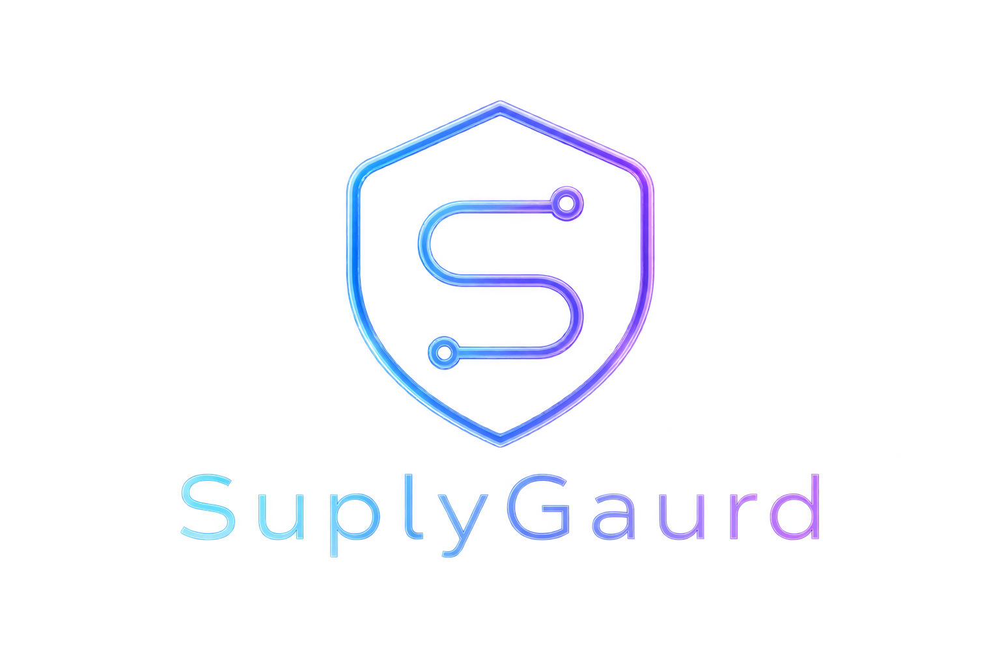
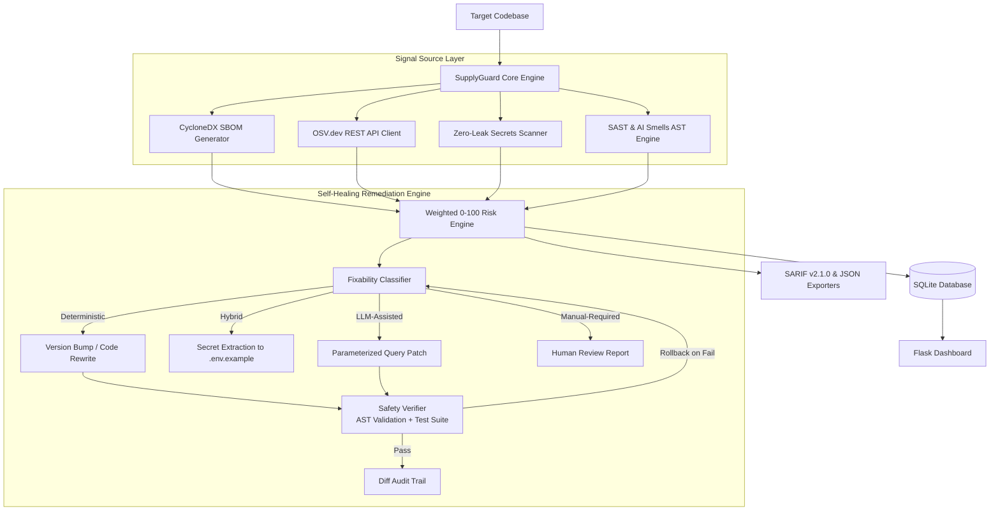

<div align="center">



# SupplyGuard

**Software Supply Chain Security Scanner & Self-Healing Remediation Engine**

[](https://pypi.org/project/supplyguard/)
[](https://www.python.org/downloads/)
[](LICENSE)
[](https://github.com/Taheraam/Supplyguard/actions)
[](https://docs.oasis-open.org/sarif/sarif/v2.1.0/sarif-v2.1.0.html)

<p align="center">
  Detect supply chain vulnerabilities, leaked credentials, and AI-generated code smells in seconds.<br>
  Compute an auditable 0–100 risk score, enforce CI/CD quality gates, and safely auto-patch fixable findings with test-backed rollbacks.
</p>

[Quickstart](#quickstart) •
[Features](#features) •
[Installation](#installation) •
[CLI Reference](#cli-reference) •
[CI/CD Integration](#cicd-integration) •
[Architecture](#architecture) •
[Security Principles](#security-principles)

</div>

---

## Overview

Modern software development relies heavily on third-party dependencies and AI code generation. However, automated coding workflows regularly introduce critical vulnerabilities:
- Unpinned or vulnerable dependencies with published CVEs
- Leaked API keys, database credentials, and access tokens committed to version control
- Antipatterns common in AI-generated code: unparameterized SQL queries, dynamic subprocess execution with `shell=True`, disabled TLS certificate verification, and unverified JWT decoding

SupplyGuard addresses this by scanning codebases across four synchronized security dimensions, unifying findings into a weighted 0–100 risk score, exporting compliant SARIF reports for GitHub Code Scanning, and providing an automated remediation loop with built-in AST verification and rollback safety.

---

## Features

- **CycloneDX SBOM Generation**: Automated manifest parsing for dependency auditing across Python projects.
- **OSV.dev Vulnerability Correlation**: Real-time batch queries against the Open Source Vulnerability database for up-to-date CVE matching.
- **Zero-Leak Secrets Scanner**: Pattern matching for API tokens and credentials with strict zero-leakage redaction (`first 3 + ... + last 3 chars`).
- **AI-Code Smell SAST**: Static analysis rules targeting security weaknesses common in LLM-assisted codebases (CWE-89, CWE-78, CWE-295, CWE-489, CWE-347, CWE-916, CWE-330).
- **Self-Healing Remediation**: Automated patch generation backed by an in-memory backup and AST verifier that rolls back any modification that introduces syntax errors or test regressions.
- **Native SARIF v2.1.0 & CI Gates**: Native export to SARIF for the GitHub Security tab and configurable risk threshold exit codes (`--threshold 40`).
- **Zero-Config Execution**: Built-in fallback engines that operate out-of-the-box without requiring external binary installations.

---

## Installation

### pipx (Recommended for global CLI use)

```bash
pipx install supplyguard
```

### pip

```bash
pip install supplyguard
```

### Docker

```bash
docker build -t supplyguard .
docker run --rm -v $(pwd):/src supplyguard scan /src
```

### From Source

```bash
git clone https://github.com/Taheraam/Supplyguard.git
cd Supplyguard
python -m venv .venv
source .venv/bin/activate  # Windows: .venv\Scripts\Activate.ps1
pip install -e ".[dev]"
```

---

## Quickstart

### 1. Initialize Configuration
Generate a `.supplyguard.yml` policy file for your project:
```bash
supplyguard init
```

### 2. Run a Read-Only Security Scan
```bash
supplyguard scan .
```

### 3. CI/CD Security Gate (Fail if Risk > 40)
```bash
supplyguard scan . --threshold 40 --format sarif -o results.sarif
```
*Exits with code `0` on pass, or code `1` if the risk score exceeds the threshold.*

### 4. Preview Automated Remediation (Dry Run)
```bash
supplyguard fix . --dry-run
```

### 5. Apply Remediation Patches
```bash
supplyguard fix . --max-iterations 3
```

### 6. Launch the Local Web Dashboard
```bash
supplyguard web --port 5000
```
*Navigate to `http://127.0.0.1:5000` to review scan history and patch diffs.*

---

## CLI Reference

### `supplyguard scan [PATH]`

Scan a target codebase for dependencies, vulnerabilities, secrets, and static code smells.

| Option | Short | Default | Description |
|---|---|---|---|
| `--format` | `-f` | `table` | Output format: `table`, `json`, or `sarif`. |
| `--threshold` | `-t` | `100` | Risk score threshold (0–100). Exits with code `1` if exceeded. |
| `--output` | `-o` | `stdout` | Write output to a specific file path. |
| `--db-path` | | `supplyguard.db` | Target SQLite database path for history tracking. |
| `--verbose` | `-v` | `false` | Enable verbose debug output. |

#### Exit Codes:
- `0`: Scan passed (Risk Score <= Threshold)
- `1`: Policy violation (Risk Score > Threshold)
- `2`: Tool execution error

---

### `supplyguard fix [PATH]`

Execute the self-healing remediation loop.

| Option | Default | Description |
|---|---|---|
| `--dry-run` | `false` | Simulate patches without modifying files on disk. |
| `--max-iterations` | `5` | Maximum number of fix-and-rescan convergence iterations. |
| `--no-llm` | `false` | Disable LLM-assisted patches and use only deterministic rules. |
| `--db-path` | `supplyguard.db` | SQLite database path. |

---

### `supplyguard report <SCAN_ID>`

Retrieve and format results from a previous scan stored in SQLite:
```bash
supplyguard report 1 --format json
```

---

## Configuration (`.supplyguard.yml`)

Project-level settings can be configured via a `.supplyguard.yml` file placed at the root of the target repository:

```yaml
# .supplyguard.yml

# Risk score threshold for CI builds (0-100)
threshold: 40

# Default output format: table | json | sarif
format: table

# Minimum severity level to include in scan results (CRITICAL, HIGH, MEDIUM, LOW)
severity_minimum: MEDIUM

# Paths to exclude from scanning
ignore_paths:
  - ".venv/"
  - "tests/"
  - "docs/"
  - "node_modules/"

# Rule IDs or CWE identifiers to suppress
ignore_rules:
  - "CWE-489"  # Allow debug=True in local development
```

---

## CI/CD Integration

### GitHub Actions

Upload scan findings directly to the **GitHub Security -> Code Scanning** tab:

```yaml
name: SupplyGuard Security Gate

on:
  push:
    branches: [ "main" ]
  pull_request:
    branches: [ "main" ]

jobs:
  security-scan:
    runs-on: ubuntu-latest
    permissions:
      security-events: write
    steps:
      - name: Checkout Code
        uses: actions/checkout@v4

      - name: Set up Python
        uses: actions/setup-python@v5
        with:
          python-version: "3.11"

      - name: Install SupplyGuard
        run: pip install supplyguard

      - name: Run Security Scan
        run: |
          supplyguard scan . \
            --format sarif \
            --threshold 40 \
            -o results.sarif

      - name: Upload SARIF to GitHub Security
        uses: github/codeql-action/upload-sarif@v3
        if: always()
        with:
          sarif_file: results.sarif
          category: supplyguard
```

---

## Architecture



---

## Fixability Classification

SupplyGuard maintains a strict separation between deterministic fixes and changes requiring architectural review:

| Finding Category | CWE | Strategy | Action |
|---|---|---|---|
| Known Vulnerable Dependency (Fix Available) | — | **Deterministic** | Bumps pinned version in `requirements.txt`. |
| Vulnerable Dependency (No Fix Available) | — | **Manual-Required** | Flags finding; no safe target version exists. |
| Hardcoded Secret | CWE-798 | **Hybrid** | Extracts stub to `.env.example`, redacts in place, flags key for rotation. |
| TLS Validation Disabled (`verify=False`) | CWE-295 | **Deterministic** | Restores TLS certificate validation. |
| Production Debug Mode (`debug=True`) | CWE-489 | **Deterministic** | Sets `debug=False`. |
| Unverified JWT Decode | CWE-347 | **Deterministic** | Enforces signature verification checks. |
| Insecure Randomness for Secrets | CWE-330 | **Deterministic** | Migrates `random` usage to `secrets` module. |
| SQL Injection (String Formatting) | CWE-89 | **LLM-Assisted** | Constructs parameterized query patch gated on test suite. |
| Subprocess Shell Injection | CWE-78 | **LLM-Assisted** | Converts shell command strings to argument lists. |
| Unprotected Sensitive Route | CWE-862 | **Manual-Required** | Escalated to developer; cannot infer authentication model. |
| Dynamic Code Execution (`eval`/`exec`/`pickle`) | CWE-94 / 502 | **Manual-Required** | Escalated to developer; requires architectural refactoring. |
| CORS Wildcard with Credentials | CWE-942 | **Manual-Required** | Escalated to developer; requires explicit origin allowlist. |

---

## Security Principles

1. **Local-Only Remediation**: `supplyguard fix` never pushes or merges changes to remote branches. All modifications remain local for developer review.
2. **Zero Raw Secret Storage**: The secrets scanner redacts findings (`first 3 + ... + last 3 chars`) before logging, database persistence, or display.
3. **Rollback-on-Failure**: Automated patches must pass syntax parsing and existing test suites before being kept. If verification fails, changes are reverted automatically.
4. **No Intent Guessing**: Security-critical controls such as authentication boundaries and authorization decorators are never guessed and are flagged for manual review.

---

## Contributing

Contributions are welcome. Please ensure that all changes include appropriate test coverage and pass static checks:

```bash
# Run unit and integration tests
pytest tests/ -v

# Run linting
ruff check .
```

---

## License

This project is licensed under the [MIT License](LICENSE).
