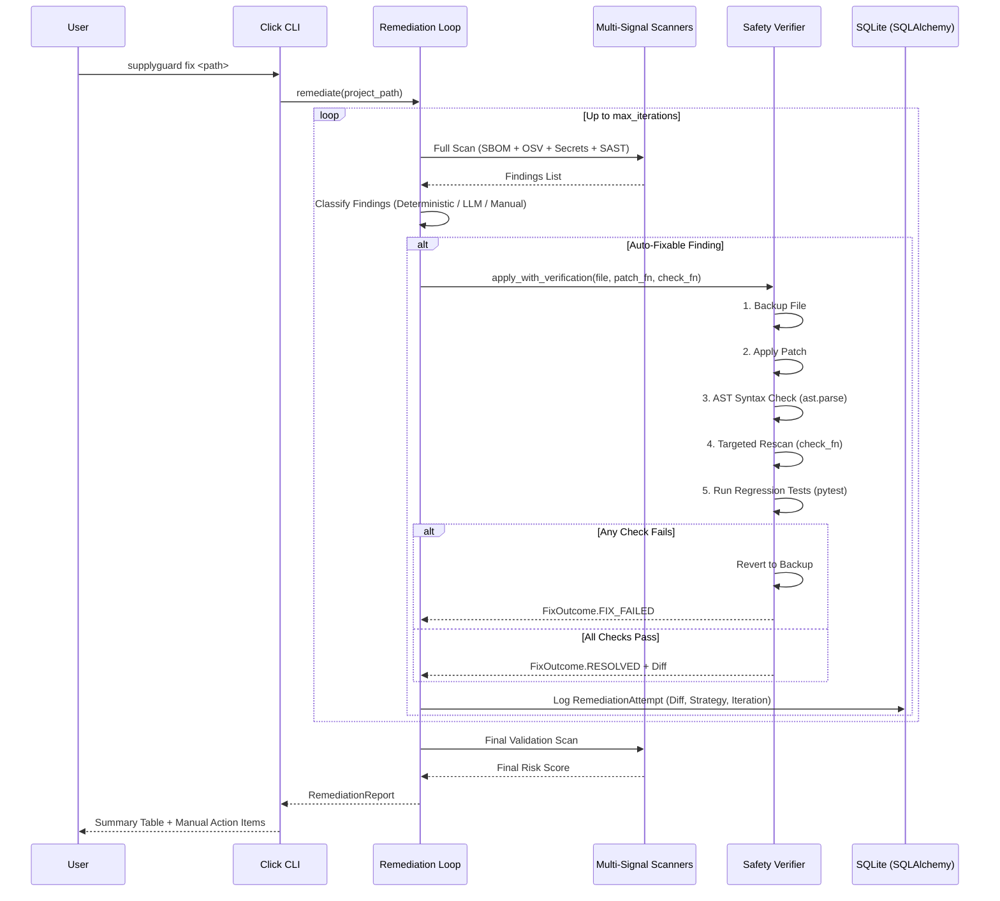

# SupplyGuard Architecture & Engineering Specification

This document details the architectural decisions, pipeline workflows, scoring engine mechanics, and safety invariants implemented in SupplyGuard.

---

## 1. System Architecture

SupplyGuard operates in two primary modes:
1. **Assessment Mode (`supplyguard scan`)**: A strictly read-only pipeline that generates SBOMs, correlates CVEs via OSV.dev, detects leaked secrets via Gitleaks, runs static analysis via Semgrep with custom AI-code rules, and computes a 0–100 risk score.
2. **Remediation Mode (`supplyguard fix`)**: A self-healing loop that classifies findings, generates targeted patches (deterministic or LLM-assisted), subjects each patch to a 5-step safety verifier with rollback protection, and rescores the repository.



---

## 2. Safety Verifier Pipeline (`supplyguard/remediation/verifier.py`)

Every automated fix attempt MUST proceed through the verifier. Direct modification of source files outside this context manager is strictly forbidden by project invariants.

### Safety Stages:
1. **In-Memory Backup**: Target file content is backed up in memory before any modification occurs.
2. **Patch Application**: The patcher function writes the minimal replacement into the target file.
3. **AST Syntax Parse**: For Python source files, `ast.parse()` evaluates the AST structure. Any syntax error immediately triggers an instant rollback to the original state.
4. **Targeted Rescan**: Only the specific detector rule that originally flagged the finding is re-executed. If the finding persists, the patch is reverted.
5. **Project Test Suite Execution**: If a `tests/` directory containing pytest suites exists in the target project, `pytest` is executed as a regression guard. If existing unit tests fail, the change is reverted.
6. **Audit Diff Computation**: When all validations pass, a unified diff (`difflib.unified_diff`) is generated and persisted to SQLite for human review.

---

## 3. Weighted Risk Scoring Formula (`supplyguard/scoring/engine.py`)

The risk score is calculated as a deterministic, auditable integer from 0 to 100:

$$\text{Risk Score} = \min\left(100, \sum \text{OSV Points} + \sum \text{Secrets Points} + \sum \text{SAST Points}\right)$$

### Point Allocation Weights:
- **OSV Vulnerabilities**:
  - `CRITICAL`: +10 points
  - `HIGH`: +5 points
  - `MEDIUM` / `LOW`: +2 points
- **Hardcoded Secrets**:
  - `CRITICAL` (immediately exploitable credential): +15 points per secret
- **SAST / AI-Code Smells**:
  - `HIGH` (e.g. SQL Injection, Subprocess `shell=True`, Unverified JWT): +8 points
  - `MEDIUM` (e.g. Disabled TLS, Weak Hash, `app.run(debug=True)`): +3 points
  - `LOW` / `INFO`: +1 point

---

## 4. LLM Patch Generation Prompt Architecture (`supplyguard/remediation/llm_fixer.py`)

When addressing structural vulnerabilities (CWE-89 SQL injection, CWE-78 subprocess injection, CWE-916 weak hashing), `AnthropicPatchProvider` constructs a prompt with minimal blast radius:

```text
You are an automated code security remediation agent.
Fix the following vulnerable Python code snippet to remediate {CWE}: {Message}.

RULES:
1. Change ONLY what is strictly necessary to resolve the vulnerability.
2. Preserve existing variable names, function signatures, and coding style.
3. Output format:
   First line: EXPLANATION: <One concise sentence explaining the fix>
   Following: The replacement code inside a ```python ``` codeblock.

Context before snippet:
{context_before}

Vulnerable snippet to replace:
{snippet}

Context after snippet:
{context_after}
```

Only the targeted snippet and immediately surrounding lines are transmitted, minimizing token overhead and preventing hallucinated broad refactorings.

---

## 5. Extension Guidelines

To add a new rule to SupplyGuard:
1. Add the Semgrep pattern into `supplyguard/sast/rules/ai-code-smells.yml` with metadata (`cwe`, `strategy`). If deterministic, include a `fix:` or `fix-regex:` block.
2. Update `classify()` in `supplyguard/remediation/classifier.py` to map the rule identifier to its fix strategy.
3. Add a test in `tests/test_sast.py` verifying both positive match (vulnerable snippet) and absence of false positive (safe snippet).
